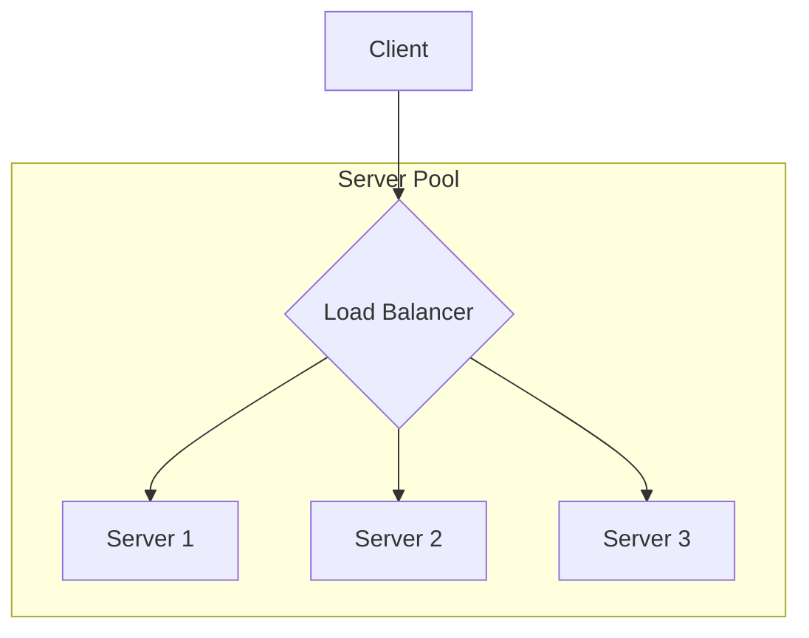

# Load Balancers: Quick Revision

A load balancer is a critical component in any scalable system. It acts as a "traffic cop" for your servers.

---

## 1. What is a Load Balancer and Why is it Needed?

*   **What it is:** A device or software that distributes incoming network traffic across a group of backend servers (a server farm or server pool).
*   **Why it's needed:** In a horizontally scaled system, you have multiple servers. A load balancer provides a single point of contact for clients, preventing any single server from being overloaded. This improves application availability, reliability, and response times.

---

## 2. Common Load Balancing Algorithms

A load balancer uses an algorithm to decide which server should receive the next request. Here are the most common ones:

| Algorithm               | How It Works                                                                        | Best For...                               | Pros                                        | Cons                                                       |
| :---------------------- | :---------------------------------------------------------------------------------- | :---------------------------------------- | :------------------------------------------ | :--------------------------------------------------------- |
| **Round Robin**         | Distributes requests to servers in a simple, rotating sequence (1, 2, 3, 1, 2, 3...).| Environments with equally powerful servers. | Simple and easy to implement.               | Ignores server load and health. A busy server gets traffic anyway. |
| **Weighted Round Robin**| Like Round Robin, but servers with higher capacity (assigned a higher "weight") get more requests. | Environments with servers of different capacities. | Better distribution on varied hardware.     | Weights are static and don't reflect real-time server health. |
| **Least Connections**   | Sends the next request to the server that currently has the fewest active connections. | Environments where connection times vary widely. | Dynamic and responsive to real-time server load. | Can be less effective if all connections are very short-lived. |
| **IP Hash / Hash-Based**| A hash of the client's IP address (or another property like `user_id`) is used to determine which server gets the request. | Applications that require **session persistence** ("sticky sessions"). | Ensures a user is consistently sent to the same server. | Can cause uneven load if many users have similar hashes. Re-hashing is needed if servers are added/removed. |
