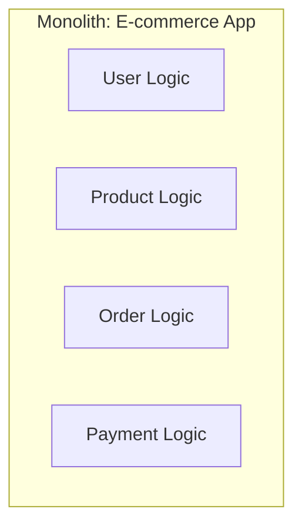
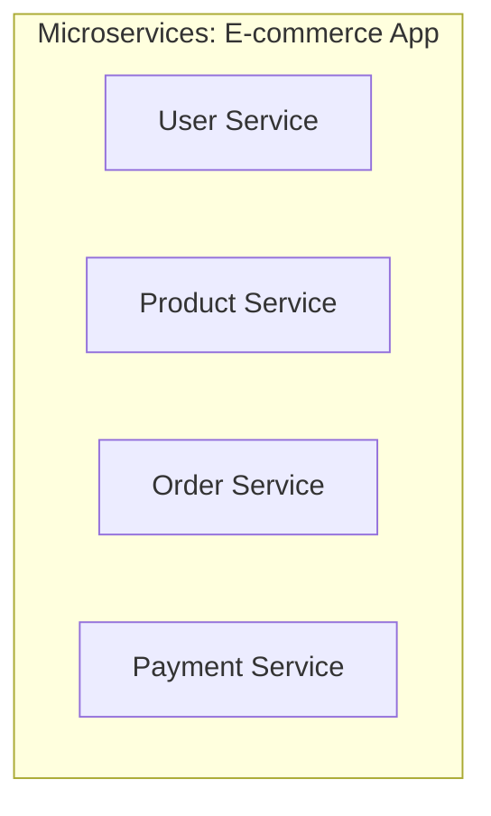
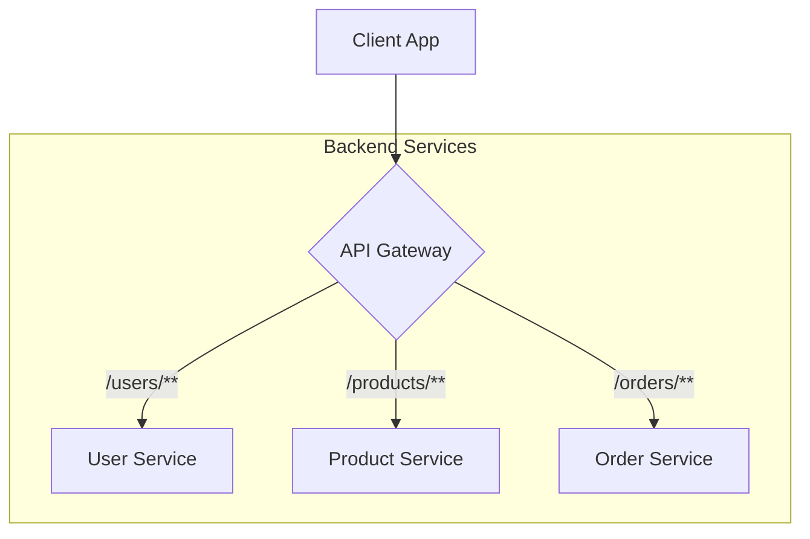

# Monolith vs. Microservices: Quick Revision

This note compares two fundamental architectural patterns for building applications.

---

## 1. Defining the Architectures

### Monolithic Architecture
*   **What it is:** The entire application is built, deployed, and scaled as a **single, unified unit**.
*   **Analogy:** A large, all-in-one office building where every department (Users, Orders, Payments) is under one roof.

### Microservice Architecture
*   **What it is:** The application is broken down into a collection of **small, independent, and loosely coupled services**.
*   **Analogy:** A business park where each department is in its own separate, self-contained building.

---

## 2. Core Comparison

| Feature                    | Monolith                                       | Microservices                                                |
| :------------------------- | :--------------------------------------------- | :----------------------------------------------------------- |
| **Development**            | Simpler to start; all code is in one place.    | More complex; requires inter-service communication.          |
| **Scalability**            | **All or nothing:** Must scale the entire application, even if only one part is busy. | **Independent:** Scale only the specific services that need more resources. |
| **Technology Stack**       | **Locked-in:** One technology stack for the entire application. | **Flexible:** Each service can use the best technology for its specific job. |
| **Fault Isolation**        | **Low:** A failure in one module can bring down the entire application. | **High:** Failure in one service typically does not affect others. |
| **Deployment**             | The entire application is deployed at once. Slower and riskier. | Services can be deployed independently. Faster and safer.     |

---

## 3. How Do Microservices Work? The API Gateway

Clients can't be expected to know the address of every single microservice. The **API Gateway** acts as a single entry point for all client requests.

*   **What it does:** It receives client requests and intelligently routes them to the correct backend microservice.

### Benefits of an API Gateway:
*   **Routing:** Directs traffic to the appropriate service.
*   **Authentication & Security:** Centralizes user authentication.
*   **Rate Limiting:** Protects services from being overwhelmed.
*   **Caching:** Caches frequent responses to improve performance.
*   **Load Balancing:** Distributes requests across multiple instances of a service.

---

## 4. When to Use Which?

*   **Start with a Monolith when:**
    *   You are building a new product or a startup with a small team.
    *   You need to iterate and validate an idea quickly.
    *   The application domain is simple and well-understood.

*   **Move to Microservices when:**
    *   Your application becomes large and complex.
    *   Your development team grows and splits into multiple smaller teams.
    *   You need to scale different parts of the application independently.
    *   You want to improve fault isolation and avoid a single point of failure.
