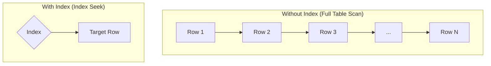
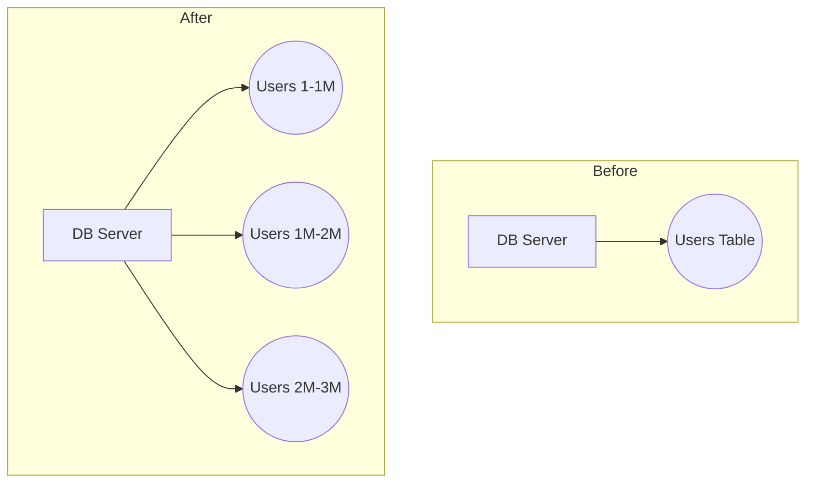
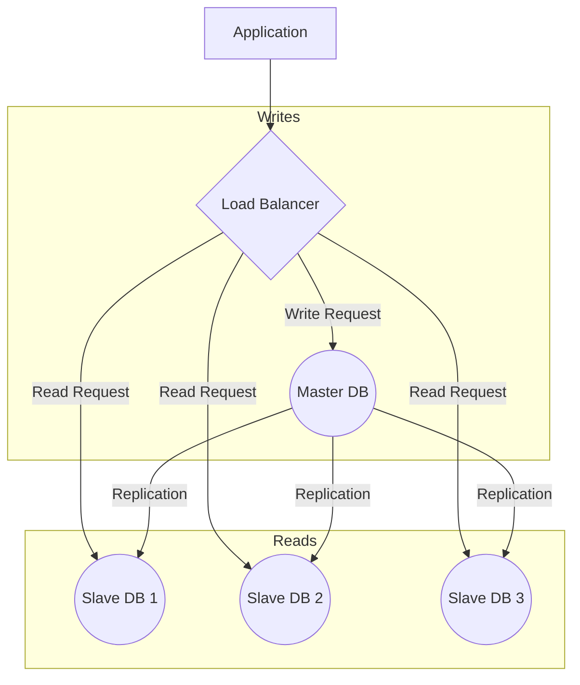

# Database Scaling Strategies: Quick Revision

Scaling a database is about increasing its capacity to handle more load. The key is to **scale incrementally**—only apply the level of scaling your current system needs.

---

## 1. Vertical Scaling (Scaling Up)

*   **What it is:** Add more resources (CPU, RAM, SSD) to your existing database server.
*   **When to use:** The first and simplest step. Do this until you hit the limits of a single machine.
*   **Pro:** Easy to implement.
*   **Con:** Has a physical limit and can get expensive.

---

## 2. Indexing

*   **What it is:** Creating a special lookup table (like a book's index) for a specific column.
*   **Goal:** Drastically speed up read queries.
*   **How it works:** Instead of scanning the entire table (`O(N)`), the database uses a B-Tree data structure to find data quickly (`O(logN)`).



---

## 3. Partitioning

*   **What it is:** Splitting one very large table into smaller, more manageable tables **within the same database server**.
*   **Goal:** Improve performance by working with smaller index files.
*   **How it works:** The database manager knows how the data is split and automatically queries the correct partition.



---

## 4. Replication: Master-Slave Architecture

*   **What it is:** Create copies (replicas) of your database on multiple servers.
*   **Goal:** Scale read-heavy workloads.
*   **How it works:**
    *   **Master Node:** Handles all **write** operations (INSERT, UPDATE, DELETE).
    *   **Slave Nodes:** Handle all **read** operations (SELECT).
    *   Data is written to the master and then asynchronously replicated to the slaves.



---

## 5. Replication: Multi-Master Setup

*   **What it is:** Multiple master nodes that can all handle **write** requests.
*   **Goal:** Scale write-heavy workloads or handle geographically distributed traffic.
*   **Challenge:** **Conflict resolution.** Logic must be implemented to handle cases where the same data is written differently on two masters.

---

## 6. Sharding (Horizontal Scaling)

*   **What it is:** The most complex step. Sharding is like partitioning, but the smaller tables (shards) are placed on **different database servers**.
*   **Goal:** Scale for massive datasets that won't fit on a single machine and for very high read/write traffic.
*   **How it works:** The application logic must know which shard to read from or write to based on a **Shard Key**.

```mermaid
graph TD
    App[Application Logic] -- "ID: 1-1M" --> Shard1[DB Server 1 <br> (Shard 1)]
    App -- "ID: 1M-2M" --> Shard2[DB Server 2 <br> (Shard 2)]
    App -- "ID: 2M-3M" --> Shard3[DB Server 3 <br> (Shard 3)]
```

### Sharding Strategies

| Strategy       | How It Works                                       | Pro                     | Con                                   |
| :------------- | :------------------------------------------------- | :---------------------- | :------------------------------------ |
| **Range-Based**| Shard based on a range of the shard key (e.g., ID 1-1000). | Simple to implement.    | Can lead to uneven data distribution. |
| **Hash-Based** | Shard based on the output of `hash(shard_key)`.      | Distributes data evenly.| Difficult to rebalance when adding shards.|
| **Geo-Based**  | Shard based on a geographic location (e.g., country). | Good for regional data. | Can create "hotspots" of traffic.     |

### Disadvantages of Sharding
*   **Implementation Complexity:** Application needs to manage routing.
*   **Cross-Shard Joins:** Very expensive and slow as they require querying across the network.
*   **Loss of Consistency:** Harder to maintain data consistency across multiple independent servers.

---

## Summary: Which Scaling Method to Use?

1.  **Start Here:** Always prefer **Vertical Scaling** first.
2.  **Read-Heavy?** Use **Master-Slave Replication**.
3.  **Write-Heavy or Massive Data?** Use **Sharding**. This is the last resort due to its complexity.
